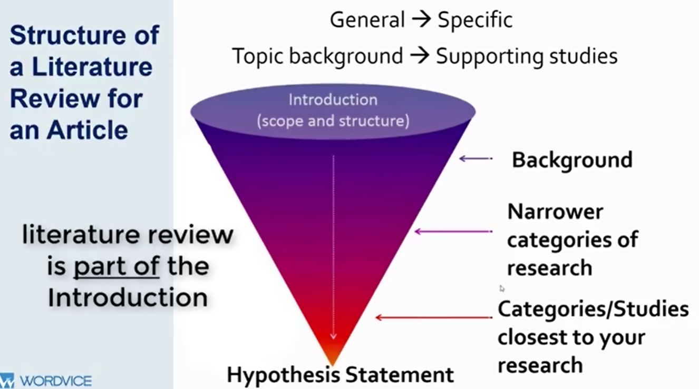
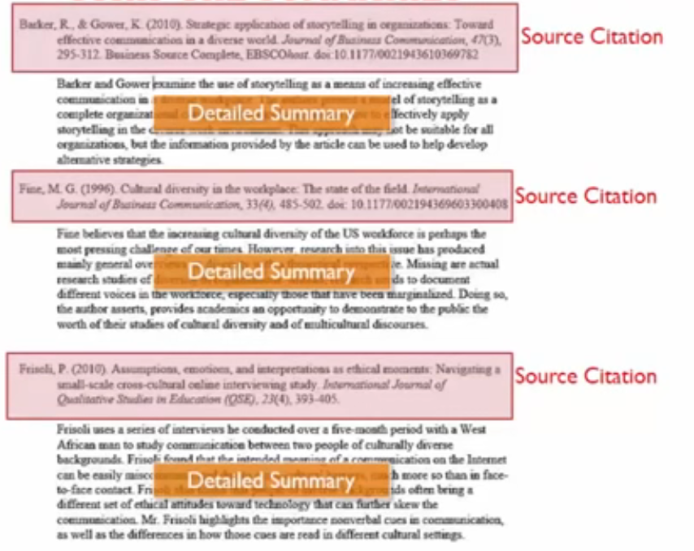
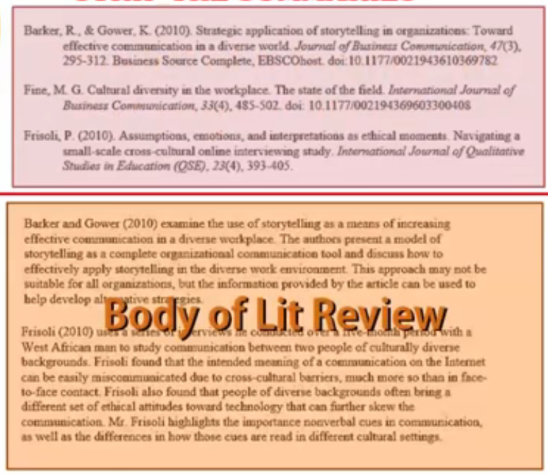
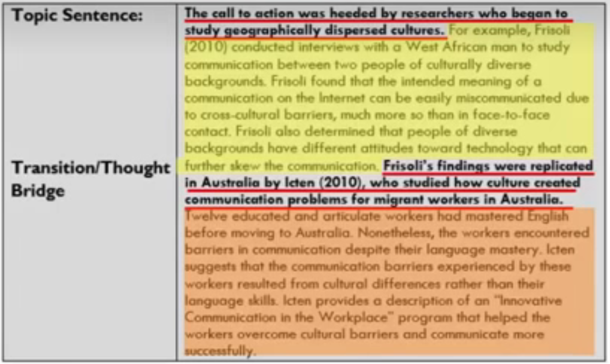

## Literature Review V.S. Review Paper

### Literature Review
+ Introduce research related to this specific study (usually in the introduction section)
+ Shorter than standalone reviews.
+ Narrower in scope
+ Often used to set research precedent and support theory or methods
+ Length: 2-4 paragraphs

### Standalone Review Articles
+ Presents and analyzes as much relevant liteature as possible to explain background and context.
+ Broader in scope
+ More extended analysis
+ All sections refer to literature rather than to one current study

> Include conclusion section, which ties all of the work together, showinghow the literature analysis contributes to the literature.

### How many sources should be reviewed?

Determined by the scope of the topic, the depth of analysis, and the extent of consensus or disagreement in this area.

### Tips for Creating Strong (Literature) Review

- Clearly define your topic and audience first
- Read many literature reviews and articles
- **Focus on more recent sources**: using all the theories that have been found as fundamental and provide a stable foundation for work that hasn’t changed over the years
- **Take notes while reading literature**

## Literature Review

> **Definition**: An objective, concise, critical **summary** of published research literature relevant to a topic being researched in an article.

### A good Literature Review will…

- Order articles and books to focus on unresolved **debates, inconsistencies, tensions, and questions** in a research field.
- Summarize the **most relevant** aspects of scientific literature related to your area of research.
- Synthesize **past and current research** on the topic and show how your research fits in.

### What is included in the Literature Review

- **Historical background**: You should show what is written in this field, so that you can present something new and significant, and contribute to the understanding of this field, even in a small way. This also demonstrates to other researchers and journal editors that you know how to write theoretical concepts and put them in your own words to show your understanding.
- **Current research context — questions, issues, debates, etc**. This means discussing questions and debates in your field. You can contextualize your work by showing related work as historical background and current state of research, and showing the development and trend of the research.
- **Relevant theories and concepts**.
- **Definition of relevant terminology** to show how terms fit into the context of your work.
- Describe related research and show how your work expands or challenges this research, and work to fill in this gap. **You can use the literature review to show what works, what doesn't, and what's missing**.
- **Supporting evidence for a practical problem/issue**, and its importance.

## Review Articles
> A good review uses **photographs, illustrations, graphs, and diagrams to aid the reader in understanding concepts**, processes, or relationships being discussed.
> 
### Type of Review

- **Narrative Review Articles**: It can target a large group of audience (that may include non-experts or non-professionals) and hence is written in a comparatively easier format than systematic review articles
- **Systematic Review Articles**
    - It mainly contains a lot more detail about a particular topic than narrative review articles.
    - It is a comprehensive review of the original
    published research and is for a specific group of people because these articles contain an in-depth analysis of a particular topic, and this kind of paper is also known as a critical review paper.
    - There are **two types** of systematic review articles, namely **qualitative and quantitative reviews**.
- **Tutorial Review Articles**
    - These articles basically emphasize how to do stuff.
    - Tutorial review papers explain how to prepare and achieve results with previously cited work and compare the methods in detail.

### Some examples of good review topic aspects

- **Advance an important or new concept**. In such a review, you summarize what is known and explain how this advances, modifies, or overturns a theory.
- **Review the validity or applicability of a widely held view**.
- **Bring together different areas of research**
- **Evaluate a method**

### Main Components

- Background
- Purpose
- Deliveries
- Challenges
- Gaps
- Correlation
- Inferences
- Directions

## Writing Process for both literature review & review articles
### Steps to follow

**Step 1: Choose a TOPIC** — focus and explore this topic (At this point, you can adjust the scope of your article or literature review)
  + Topic you are familiar with and interested in
  + Topics that are current, well-established, and have ample research for review
  + Topic your readers and other researchers will be interested in

**Step 2: RESEARCH** — collect scholarly information and sources. The literature includes scholarly articles, books, dissertations/theses, and conference papers.

**Step 3: ANALYZE the network of information and SELECT the works**
    + Use thought maps and charts to identify intersections of the research and outline important categories
    + Select the material most useful to your review

**Step 4: DESCRIBE and SUMMARIZE each selected article** (Strip the summaries)
1. When doing the background research, record the source of the information to allow others to validate what you said. This will lead to a sort of citation-details pairs that look like the following.

2. Then you should split these information into two parts: the citations list and paragraphs containing information from the sources. (I think for the paragraphs, I'd better write it in my own languages.)

**Step 5**: DEMONSTRATE how concepts in the literature relate to results of the study; **ESTABLISH how the literature is connected**.
+ <u>For intro to a journal article</u>:
    + Identify the missing parts in previous studies that your study address.
    + Highlight concepts that support your hypothesis, methods, results, or conclusions.
+ <u>For a stand-alone literature review</u>:
    + Highlight the concepts in each article and show how they strengthen a hypothesis or show a pattern.
    + Identify unaddressed issues in previous studies.
    + Identify what is accurate and what is out of scope within these works.

**Step 6**: Focus on the connections between the literature and the current study or guiding concept/argument. Your hypothesis, argument, or guiding concept is GOLDEN THREAD!
+ Step 6a. Re-order paragraphs
    + Re-read all paragraph summaries
    + Find similarities and differences
    + Re-order paragraphs into logical list based on connections you find
    
    > Notice: There will be no single correct way to re-arrange the paragraphs. The best is the one that you found effective. 
    
    <u>Some potential arrangements</u>:
    + Cause-Effect
    + Series of Advances
    + Myths-Realities
    + Problem-Solution
    + Ancient-Modern
    + Effective-Ineffective

+ Step 6b. Combine paragraphs (If necessary)
    
    You should decide which paragraph should stand alone as a paragraph, and which could be combined. Your decision would be based on two factors:
    
    - How closely related are the summaries?
    - How long will the paragraph be? Try to limit to 10-14 lines.
    
    Sometimes, for instance, if you found there are three articles write the similar thing, but it is too long to combine them. You can combine part of them maybe as two paragraphs.

+ Step 6c. Add topic sentences & Transitions. (This step is all about turning the summary paragraphs into the real paragraphs.)

+ Step 6d: Add introduction & Conclusion
    <u>Introduction</u>: because the literature review summarize the published works by others, the thesis statement should bring together points dicussed by the sources
    
    <u>*Conclusion</u>: 
    + One common strategy for the conclusion is open with the re-statement of the thesis, which brings the readers back to the overall point.
    + Another common strategy for the conclusion is to comment on any gaps or flaws in research reviewed.
  

### Precautions

- **You need to be very careful about the logical order of a series of sentences from different citations**. For example, is this paragraph stated around a certain point? And is there any relationship or transition between sentences?
- **How to deal with the classical papers and the more recent papers?**
    - It is recommended that in each paragraph, start with the classical papers as the foundation of the statement, and end with more recent papers. And in such a single paragraph, try to present  how this direction of research develops

## Referenced Sources
1. https://www.bilibili.com/video/BV1eJ41167Ue?p=1 Include both an introduction on how to write a literature review for introducing and for a review paper. 
2. https://www.bilibili.com/video/BV1eJ41167Ue?p=2 Introduce 5 steps to actually compose a literature review, but still applies to the review paper.
3. https://youtu.be/b72N-Qu7A90. It's too broad, I only pick up something that I don't know.
4. https://youtu.be/bsoGBkf7mmE Also somewhat broad.
5. https://youtu.be/kExJSYtv0ck Provide some suggestions about topic choosing.