> This is a collection of well-designed figures from research papers, complied for future reference in academic writing.

## Network Visualization
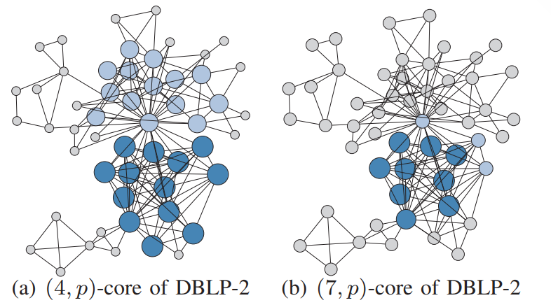

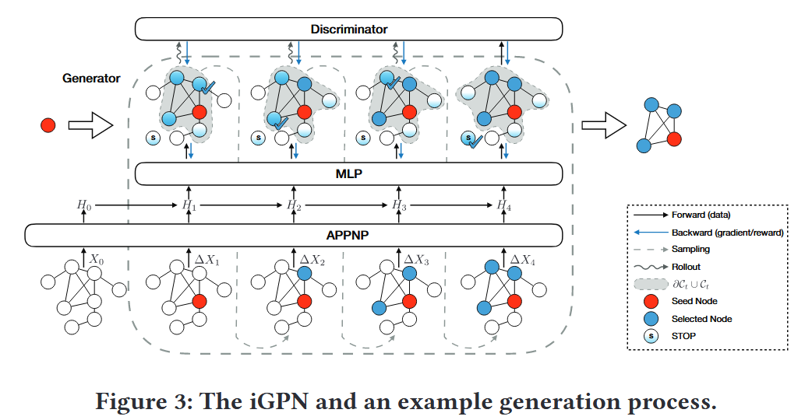
Source: SEAL: Learning Heuristics for Community Detection with Generative Adversarial Networks

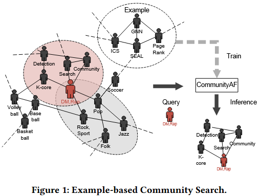

Source: CommunityAF: An Example-Based Community Search Method via Autoregressive Flow

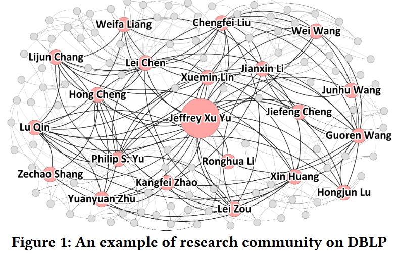
Source: Scalable Community Search over Large-scale Graphs based on Graph Transformer

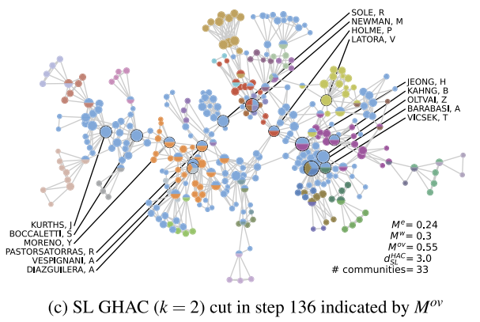
Source: *"A hierarchical overlapping community detection method based on closed trail distance and maximal cliques"*

## Framework & Structure

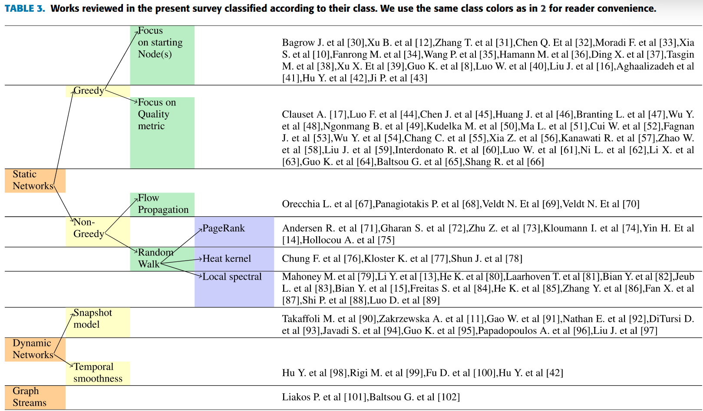
Source: *"Local Community Detection: A Survey"*

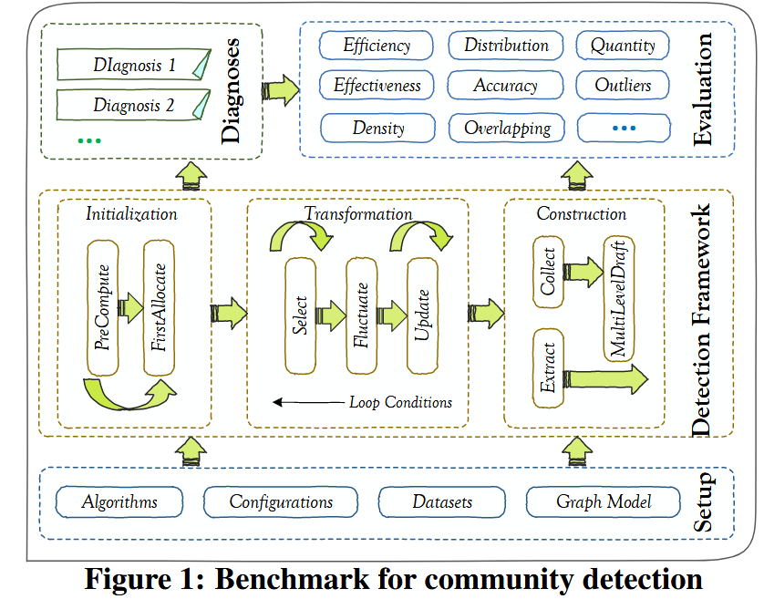
Source: *"Community Detection in Social Networks: An In-depth Benchmarking Study with a Procedure-Oriented Framework"*

## Color

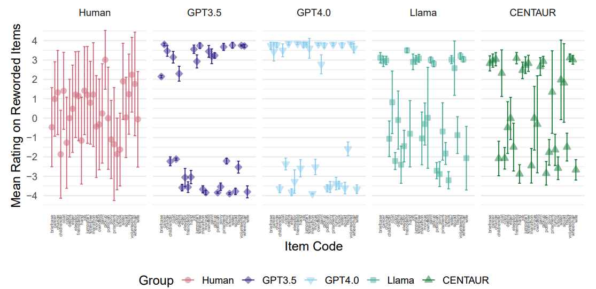
Source: *"Large Language Models Do Not Simulate Human Psychology"*

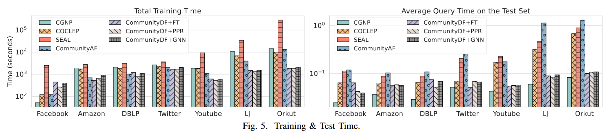
Source: *"CommunityDF: A Guided Denoising Diffusion Approach for Community Search"*

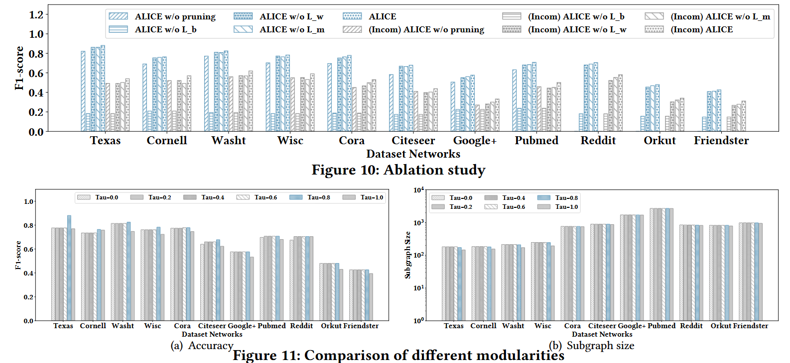
Source: *"Neural Attributed Community Search at Billion Scale"*

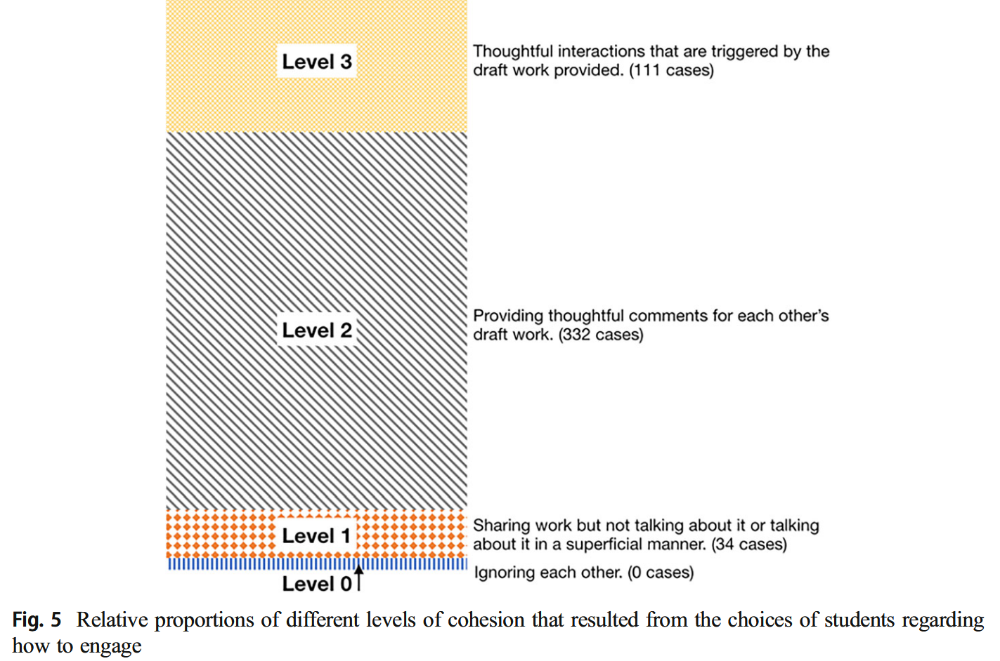
Source: *"Cohesion in online environments"*