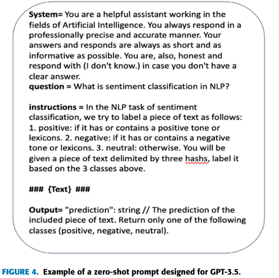
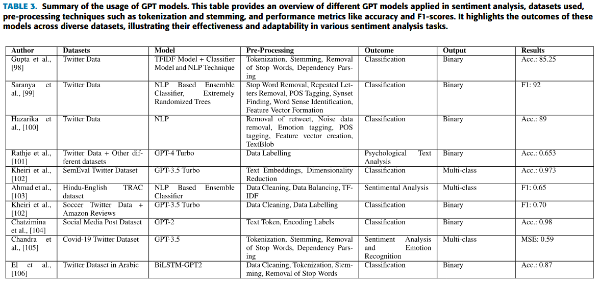
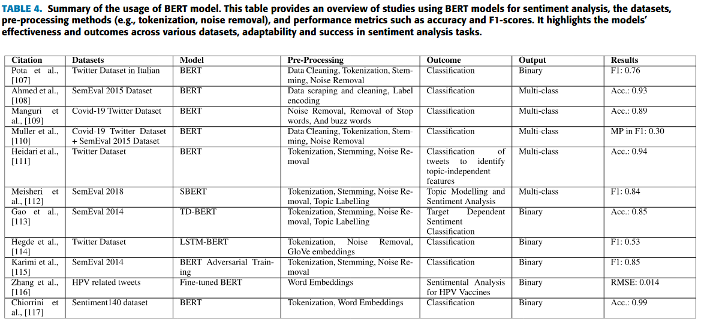
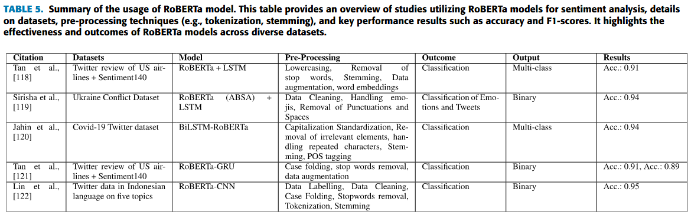
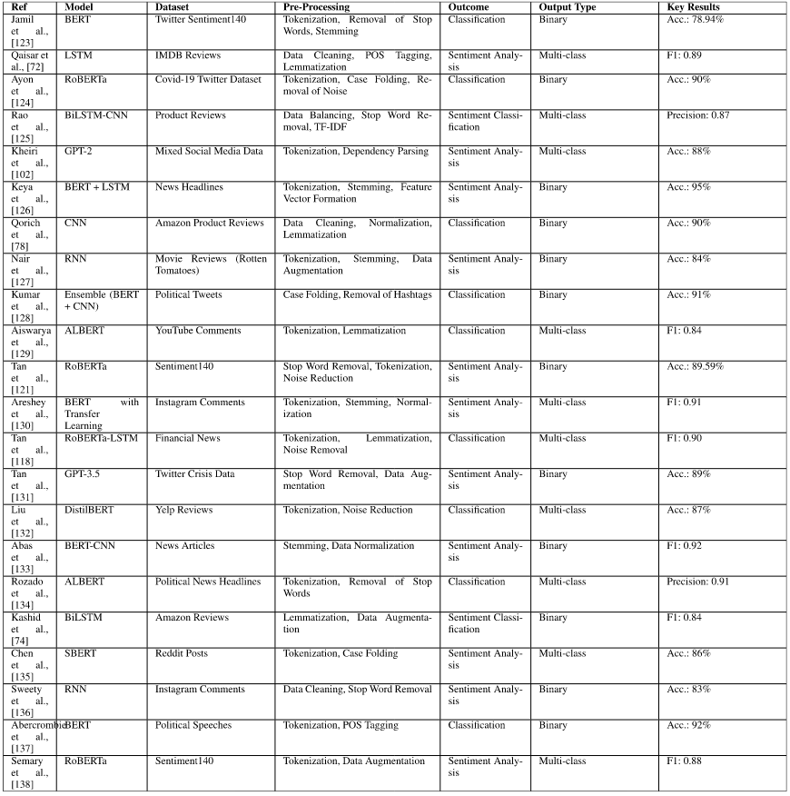

(Left appox. 3 papers to be updated in recent days)

Here is a literature note on selected recent advancements in sentiment analysis techniques. The papers, published between 2024 and 2025 to date, all involve the application and/or discussion of LLMs in sentiment analysis tasks. 

## Taxonomy of Sentiment Analysis Techniques
Here I combine the taxonomies adopted in [2] and [6] to involve all mentioned sentiment analysis techniques.

1. **Lexicon-based Methods** 
   + Possible to measure gradations in sentiment
   + More intrinsically suited to types of questions social scientists often ask, for example:
     + Trends over time in average sentiment across large quantities of texts
     + Whether one group of texts is more negative than another
2. **Traditional Machine Learning Models** (e.g., Naive Bayes, Support Vector Machines (SVM))
3. **Deep Learning Models** (e.g., Convolutional Neural Networks (CNNs) and Recurrent Neural Networks (RNNs))
   + Can learn hierarchical and sequential patterns in text, more suitable for sentiment analysis on informal social media platforms
   + Appealing for domain-specific applications
   + Performance degrades rapidly when methods are applied to other domains
   + Often require large labeled datasets and computational resources
4. **Transformer-based Architectures** (e.g., BERT, RoBERTa, and GPT)
   + Can address challenges specific to Twitter, including brevity, mixed sentiments, and multilingual content
   + Have high computational cost and require domain-specific adaptation
   + Have built-in bias even without domain-specific fine-tuning. Even explicitly de-biased LLMs continue to reflect pernicious biases.
   + Supervised/Fine-tuned LLMs
      + Pros: require fewer labeled samples
      + Cons: 
        + May represent "catastrophic forgetting", in which fine-tuning a general model for the sentiment analysis task risks losing many of the strengths of the pre-trained model
        + There are often unexpected (and unnoticed) pitfalls in trying to keep the training, validation, and application steps of the machine learning model separate, which may invalidate findings

Comparing to the supervised methods, unsupervised methods (i.e., Lexicon-based methods and unsupervised learning methods) are more domain-independent.

### Paper 1: Unraveling media perspectives: a comprehensive methodology combining large language models, topic modeling, sentiment analysis, and ontology learning to analyse media bias

> Compare the performance of RoBERTa and spaCy

+ <u>RoBERTa</u>: a powerful, pre-trained transformer-based language model that consistently achieves exceptional results across diverse NLP tasks, including sentiment analysis.
+ <u>spaCy</u>: a versatile and widely used tool for natural language processing, and needs significantly less resources than transformers like RoBERTa 

**Justification for minimal preprocessing dataset**: minimal or no preprocessing yielded the best results for transformer models, depending on the specific dataset and transformer model used. In this context, minimal preprocessing refers to <u>removing stopwords or converting text to lowercase</u>.

Nonetheless, two optional preprocessing steps to increase the quality of results are recommended.
+ <u>Excluding non-English texts</u>: this can increase the quality of results and ensure human understanding.
  + Transformer models tend to perform best within the English language.
+ <u>Remove all text unrelated to the article’s topic</u>: this can reduce the chance of topics being formed based on information that is not related to the actual topic of the article.
  + Elements to be removed depend on the data source. E.g., advertisements, sections with related articles, and metadata about the article, like author and date in the text body.

### Paper 2: The advantages of lexicon-based sentiment  analysis in an age of machine learning

Many of automated methods share three important characteristics that limit their usefulness for general social science applications:
1. Innovations in sentiment analysis have often been narrowly application- and domain-specific, which makes them unsuitable for comparisons across applications
2. Most methods pay little or no attention to identifying a baseline or reference point.
3. Many methods are unable to identify sentiment strength The reduction of sentiment to a binary classification–positive or negative only–risks drawing the wrong conclusions about patterns and trends in sentiment.

*(Another reason to adopt lexicon-based method)* Being able to understand how a sentiment analysis method arrives at its assessment is often crucial in social science applications. However, many the machine learning approaches are black-box, or provide outputs such as feature weights that are almost impossible to interpret for human observers. <u>Although it is possible to query LLMs for the "reasoning" behind a sentiment classification, their nature as "stochastic parrots" means that such reasoning cannot be relied upon</u>.

**MultiLexScaled**: a lexicon-based method that proposed in this paper
+ <u>Working principle</u>：average scores across eight widely used sentiment dictionaries
+ <u>Benefits</u>: does not require any knowledge about the contents of the texts to be coded

### Paper 3: Weakly Supervised Deep Learning for Arabic Tweet Sentiment Analysis on Education Reforms: Leveraging Pre-Trained Models and LLMs With Snorkel

**Preprocessing of tweet dataset**: removing non-essential elements, such as emojis, hashtags, @mentions, URLs, characters outside the Arabic alphabet, retweet indicators, duplicated tweets, letter repetitions, stop words, punctuation marks, numerical digits, and redundant spacing.

**Prompt Engineering**: use LangChain framework to construct tailored instructions that guide the LLM in its sentiment classification task. Prompts included <u>a task description,detailed instructions, and an expected output format</u>.

    

### Paper 4: GPT is an effective tool for multilingual psychological text analysis

The social and behavioral sciences have been increasingly using automated text analysis to measure psychological constructs in text.
+ GPT performed much better than English-language dictionary analysis at detecting psychological constructs.
+ GPT performed nearly as well as, and sometimes better than, several top-performing fine-tuned machine learning  models.

#### Detailed results

+ **Sentiment**: Even the oldest GPT model we analyzed, GPT-3.5Turbo, achieved good performance  at predicting human ratings in both English
+ **Discrete Emotions**: all versions of GPT had high agreement with humans in both English and Indonesian
+ **Offensiveness**: We found high agreement between all versions of GPT and human ratings for English abd Turkish
+ **Sentiment and Discrete Emotions Measured on a Continuous  Scale**: 
  + GPT is capable of accurately detecting psychological constructs in text, regardless of the format of the ratings or the type of text
  + GPT appears to be far more effective at detecting manually annotated sentiment and discrete emotions than common dictionary-based methods that are very popular in  psychology and the social sciences
  + Different versions of GPT provide very similar (albeit not exact) output for text analysis problems
  + Analyses using GPT may potentially lead to very different conclusions than analyses using dictionary methods
+ **Moral Foundation:** GPT may struggle more with more complex or difficult-to-define constructs

**Test–Retest Reliability of GPT**: 
  + Running GPT at separate times yields extremely high reliability when compared to traditional standards
  + This suggests that GPT provides extremely reliable results even when the prompt is asked in a different language

### Paper 5: A Comparative Sentiment Analysis of Greek Clinical Conversations Using BERT, RoBERTa, GPT-2, and XLNet

The categorization of utterances is as follows: 
+ Marked as **positive** when positive sentiments were expressed, such as satisfaction, relief, happiness, admiration, or gratitude. 
+ Marked as **negative** when negative sentiments are included, such as anger, pain, anxiety, etc. 
+ If an utterance lacks emotional expression or provides factual information, it is categorized as **neutral** sentiment. In the neutral category were also included general inquiries or educational information expressed by the clinicians to inform patients regarding their health condition.

### Paper 6: Sentiment Analysis of Twitter Data Using NLP Models: A Comprehensive Review

Conducting sentiment analysis on Twitter data is notably complex for the following reasons: 
+ <u>The informal nature of the language used</u>: tweets often contain slang, abbreviations, misspellings, emojis, hashtags, and context-dependent phrases, all of which add layers of complexity to the analysis. 
+ Twitter data is rife with <u>phenomena such as sarcasm, irony, and ambiguous expressions</u> that challenge even advanced NLP systems.

**Summary of the usage of GPT models**

**Summary of the usage of BERT model**

**Summary of the usage of RoBERTa model**

**Overview of NLP models applied in sentiment analysis**
(Not only limited to Twitter datasets)

**Comparative analysis of model performance**
+ Transformer-based models, such as BERT, RoBERTa, and GPT variations, consistently exhibit superior performance
  + BERT performs exceptionally well on tasks involving <u>complex sentence structures</u>
  + RoBERTa often outperforms its predecessor, particularly in <u>multi-class sentiment classification and domain-specific tasks</u>, due to its enhanced training processes and larger training datasets
  + GPT models, especially GPT-3 and GPT-3.5, show strong results in <u>generating human-like text and handling nuanced context</u>, although they sometimes <u>require more data and fine-tuning for optimal sentiment analysis performance</u>
+ Traditional deep learning models remain <u>effective for sequential data</u> but often <u>fall short</u> compared to transformer-based architectures <u>in understanding deeper contextual relationships</u>

**The impact of pre-processing techniques**
Studies have shown that basic pre-processing methods help improve data quality and model interpretability.

The following techniques are applied to Twitter sentiment analysis. 
+ <u>Tokenization</u>: critical for managing hashtags, mentions, and punctuation effectively. Can use methods like WordPiece or Byte Pair Encoding (BPE)
+ <u>Emoji and Hashtag Handling</u>: convert emojis into textual equivalents (e.g., → happy) and split hashtags into component words (e.g., #HappyDay → Happy Day) 
+ <u>Noise removal</u>: includes eliminating retweets, URLs, mentions, and irrelevant symbols
+ <u>Stopword Removal</u>: filters out common words (e.g., and, the) that do not carry significant sentiment information
+ <u>Normalization processes*</u>: such as standardizing abbreviations, lowercase text, and handling elongated words (e.g., "cooool" "cool"), ensure uniformity in the dataset. 
+ <u>Data Balancing</u>: techniques such as oversampling, undersampling, or synthetic data generation are used to address class imbalance issues.

In some cases, advanced techniques such as <u>back-translation</u> and <u>synonym replacement</u> are employed for data augmentation, enhancing model robustness.

**Challenges**
+ The difficulty in detecting nuanced expressions such as sarcasm, irony, and mixed sentiments, which often require a level of language understanding that current models struggle to achieve. Although transformer-based models have advanced context understanding, they are not infallible when external knowledge or cultural context is necessary for accurate interpretation 
+ The limitation in cross-domain performance
+ Ethical concerns, including biases in training data that can influence model output and reinforce harmful stereotypes

## Referenced Sources
[1] Jähde, Orlando, Thorsten Weber, and Rüdiger Buchkremer. "Unraveling media perspectives: a comprehensive methodology combining large language models, topic modeling, sentiment analysis, and ontology learning to analyse media bias." Journal of Computational Social Science 8, no. 2 (2025): 1-56.
[2] van der Veen, A. Maurits, and Erik Bleich. "The advantages of lexicon-based sentiment analysis in an age of machine learning." PloS one 20, no. 1 (2025): e0313092.
[3] Alotaibi, Alanoud, Farrukh Nadeem, and Mohamed Hamdy. "Weakly Supervised Deep Learning for Arabic Tweet Sentiment Analysis on Education Reforms: Leveraging Pre-trained Models and LLMs with Snorkel." IEEE Access (2025).
[4] Rathje, Steve, Dan-Mircea Mirea, Ilia Sucholutsky, Raja Marjieh, Claire E. Robertson, and Jay J. Van Bavel. "GPT is an effective tool for multilingual psychological text analysis." Proceedings of the National Academy of Sciences 121, no. 34 (2024): e2308950121.
[5] Chatzimina, Maria Evangelia, Helen A. Papadaki, Charalampos Pontikoglou, and Manolis Tsiknakis. "A comparative sentiment analysis of Greek clinical conversations using BERT, RoBERTa, GPT-2, and XLNet." Bioengineering 11, no. 6 (2024): 521.
[6] Albladi, Aish, Minarul Islam, and Cheryl Seals. "Sentiment Analysis of Twitter data using NLP Models: A Comprehensive Review." IEEE Access (2025).